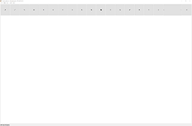

## 介绍/Introduction
**用途**：此程序为中国科学技术大学2019年秋季学期面向对象大实验，作用和画图类似。  
  
**代码框架**：代码主要分为MainWindow和OpenGLWindow两个大类，前者是UI界面及交互相关，后者为画板框架和图形处理相关。

**开发工具**：Qt5，OpenGL-glut

**使用环境**：基于Windows系统操作的电脑，可用于Windows平板（具有触控笔功能）和台式机或者笔记本电脑。

**界面**：  
  

## 实现/Achieve
#### 一、UI界面
* 由于Qt提供了比较好的UI设计，因此为了美观以及便捷因素，选择了使用UI文件进行设计，可在源码中的ui文件查看，这里实现了应用程序的图标，菜单栏，工具栏机器图标的设计。  
#### 二、commmon.h
* 用于对程序中中文的兼容，只有一个函数，不多介绍。
#### 三、MainWindow类
* 使用Qt进行设计，定义了如下函数：
```c++
    /*  triggered的槽函数都是点击按钮具体的实现  */
    void on_newPaint_triggered();
    void on_actionExit_triggered();
    void on_actionSave_triggered();
    void on_actionOpen_triggered();


    void on_drawLine_triggered();
    void on_drawPoint_triggered();
    void on_drawCurve_triggered();
    void on_drawCircle_triggered();
    void on_drawEllipse_triggered();
    void on_drawRect_triggered();

    void on_drawPoligon_triggered();
    void on_drawFilledPoligon_triggered();

    /*  各个按钮的点击信号的槽函数，因为使用了默认的槽函数，不需要再重新写connect  */
    void on_Point_clicked();
    void on_Line_clicked();
    void on_Curve_clicked();
    void on_Circle_clicked();
    void on_Ellipse_clicked();
    void on_Rect_clicked();

    void on_Poligon_clicked();
    void on_FilledPoligon_clicked();

    void on_chooseByPid_triggered();
    void on_ChooseByPid_clicked();
    void on_chooseRect_triggered();
    void on_ChooseRect_clicked();
    void on_choosePologon_triggered();
    void on_ChoosePoligon_clicked();
    void on_chooseInvert_triggered();
    void on_ChooseInvert_clicked();
    void on_Move_clicked();
    void on_move_triggered();
    void on_Rotate_clicked();
    void on_rotate_triggered();
    void on_Zoom_clicked();
    void on_zoom_triggered();
    void on_Delete_clicked();
    void on_deleteZone_triggered();

    void on_ButtonChooseColor_clicked();
    void on_PointSize_currentIndexChanged(int index);

    void on_Undo_clicked();
    void on_Redo_clicked();
    void on_undo_triggered();
    void on_redo_triggered();

    void on_action_3D_plus_triggered();
    void on_action_3D_minus_triggered();
    void on_threed_plus_clicked();
    void on_threed_minus_clicked();

```
#### 四、OpenGLut类
```c++
class OpenGLWindow : public QOpenGLWidget, protected QOpenGLFunctions
{
    Q_OBJECT
private:
    unsigned currentID; //当前图元编号
    int currentMode; //当前画图模式
    unsigned currentPointSize; //当前画笔粗细
    double currentColor[3]; //当前画笔颜色

    double originX; //记录鼠标起始点位置x
    double originY; //记录鼠标起始点位置y

    bool isLeftButtonPressed; //左键是否被按下
    bool isRightButtonPressed; //右键是否被按下
    bool isChoosingPoints; //是否正在选择区域
    bool isNewChosen; //是否新选择了一块区域
    bool isDrawPoligonJustNow; //是否刚画了多边形

    bool moveTextFlag = false;

    GLfloat AngleX;
    GLfloat AngleY;
    int rectSize;

    std::vector<Entity*> points; //画布上所有点的集合
    std::vector<Entity*> trashPoints; //被撤销的点的集合
    std::vector<Entity*> chosenPoints; //被选取点的集合
    std::vector<std::pair<double, double>> tempPoints; //用户画图的顶点集合

    QLineEdit *edit = nullptr;

public:
    OpenGLWindow(QWidget *parent = 0);
    ~OpenGLWindow();

    void cleanTempPoints();  //清空tempPoints
    void cleanTrashPoints();  //清空trashPoints 撤销后一旦开始画图即清空
    void cleanPoints();  //清空points
    void cleanChosenPoints();  //清空chosenPoints 在chooseCancel中会被调用

    unsigned getPosByPID(unsigned id); //通过PID从points中
    int getMode(){return currentMode;} //获取画图模式
    int getTrashPointsAmounts(); //获取TrashPoints的ID数量
    int getRectSize(){return rectSize;}//获取3维六面体的边长

    void setCurrentMode(int m);  //修改画图模式获取插入位置
    void setCurrentColor(double r, double g, double b);  //设置画笔颜色
    void setCurrentPointSize(int x);  //设置画笔粗细
    void setRectSize(int x);  //设置3维六面体的边长

    void drawPoint(double x, double y); //画点
    void addNewText( double localPosX, double localPosY,double loc_x, double loc_y);//添加文字
    void drawLine(double x1, double y1, double x2, double y2); //画线
    void drawCruve(); //画曲线
    void drawCircle(double xc, double yc, double r); //画圆
    void drawEllipse(double x0, double y0, double a, double b); //画椭圆
    void drawRect(double x1, double y1, double x2, double y2); //画矩形
    void drawFilledRect(double x1, double y1, double x2, double y2); //画填充矩形
    void drawPoligon(); //画多边形
    void drawFilledPoligon(); //画填充多边形
    void editorLostFocus(drawText *item);

    void chooseEntityWithSamePID(double x, double y); //选择pid相同的所有点
    void chooseRect(double x1, double y1, double x2, double y2); //选择一块矩形区域
    void choosePoligon(); //选择一块多边形区域
    bool isPointInPoligon(double x, double y); //判断点是否在tempPoint的顶点群组成的多边形内
    void chooseCancel() //取消选择
    void chooseInvert() //反向选择
    void moveChosenZone(double localPosX, double localPosY,double offsetX, double offsetY); //移动所选区域
    void rotateChosenZone(double angle); //旋转所选区域
    void zoomChosenZone(double pix); //缩放所选区域
    void deleteChosenZone(); //删除所选区域
    void pickChosenPoints(); //从points中提取出被选中的点
    void moveTxtPos(double localPosX, double localPosY, QLineEdit *ite);
    void saveToFile(char *filepath); //将画布内容保存到文件 TODO
    void openFile(char *filepath); //打开文件并画到画布 TODO
    void newPaint();
    void traceUndo(); //撤销
    void traceRedo(); //恢复
    void show3D(); //显示3维6面体
protected:
    void initializeGL();
    void resizeGL(int width, int height);
    void paintGL();
    void mousePressEvent(QMouseEvent *event);
    void mouseMoveEvent(QMouseEvent *event);
    void mouseReleaseEvent(QMouseEvent *event);
public slots:
    void editFinished();
};
```

## 操作/Operation
### 由于一直未查询到触控笔橡皮擦的命令，否则可以直接在检测到触控笔橡皮擦的时候调用删除区域的函数，实现类似OneNote的一个比较完美的手写记笔记功能。
#### 一、窗体的控制
**自适应窗体大小**

* 在实验过程中，由于实验机器的显示器像素比较高，在本机上效果很好，但当显示器变化时，观感不是很好，在版本2中，修改固定窗口格式为可变化窗口，同时支持最大化最小化，窗体的操纵与一般应用的操纵相当。  
  
  

#### 二、图形数据的输入和编辑功能
**画点**  
* 用户可以通过“插入-画点”或者工具栏的按钮进入画点模式左键按下即可画点，按下不松开并以中到慢的速度拖动可以画出自由曲线，效果如图所示。  可用于绘图和手写字。
* 用户可以通过触控笔选中工具栏中画点按钮后，直接在画板上作图，效果如图所示。  

 
**画线**  
* 用户可以通过“插入-直线”或者工具栏的按钮进入画线模式，左键第一次按下即为开始点，第二次按下即为结束点，如果第二次不松开并拖动可以修改结束点的位置为当前鼠标位置。松开后，依然可以通过按下右键并拖动鼠标修改结束点的位置。效果如图所示。  
* 用户可以通过触控笔选中工具栏中画线按钮后，直接在画板上作图，效果如图所示。  

  
**画曲线**  
* 画曲线实现方式是采用openGL算法的Bezier画线算法实现的，    其中第一个点和第四个点用于确定曲线起始位置，中间两个点确定曲线的弯曲方式和程度。
* 用户可以通过“插入-曲线”或者工具栏的按钮进入画曲线模式，单击四次即为选择了四个点，选择了四个点后自动画曲线。如果第四次不松开并拖动可以修改最后一个点的位置为当前鼠标位置。松开后，依然可以通过按下右键并拖动鼠标修改最后一个点的位置。效果如图所示。  
* 用户可以通过触控笔选中工具栏画曲线按钮后，点击四个点绘制。  

  
**添加文本**
* 添加文本功能，可自定颜色。  


**画矩形/填充矩形**  
* 用户可以通过“插入-矩形/填充矩形”或者工具栏的或按钮进入画矩形或填充矩形模式，左键第一次按下即为对角线起点，第二次按下即为终点。如果第二次不松开并拖动可以修改终点的位置为当前鼠标位置。松开后，依然可以通过按下右键并拖动鼠标修改终点的位置。效果如下图所示。
* 用户可以通过触控笔选中工具栏画矩形按钮后，点击矩形对角点两个点绘制。*[注释]：填充矩形功能在版本2中删除,下同。  

  
**画多边形/填充多边形**  
* 用户可以通过“插入-多边形/填充多边形”或者工具栏的或按钮进入画多边形或填充多边形模式，单击即为选定一个顶点，直到按下右键为止并至少有三个顶点将开始画多边形。若按住右键不松，则可以修改最后一个顶点的位置为当前鼠标位置，并重新绘制。效果如图所示。  
* 用户可以通过触控笔选中工具栏画多边形按钮后，点击位置确定多边形顶点，长按生成多边形。  

  
**画椭圆**  
* 用户可以通过“插入-椭圆”或者工具栏的按钮进入画椭圆模式，左键第一次按下即为椭圆心，第二次按下即为长轴的一个端点，第三次按下即为短轴的一个端点，如果第三次不松开并拖动可以修改短轴上的点的位置为当前鼠标位置。松开后，依然可以通过按下右键并拖动鼠标修改短轴上的点的位置。效果如图所示。  
* 用户可以使用触控笔，在选中画椭圆按钮后，触控三个点，原理与上相同，松开第三个点即可绘制。  

 
**画圆**  
* 用户可以通过“插入-圆形”或者工具栏的按钮进入画圆模式，左键第一次按下即为圆心，第二次按下即为圆周上的点，如果第二次不松开并拖动可以修改圆周上的点的位置为当前鼠标位置。松开后，依然可以通过按下右键并拖动鼠标修改圆周上的点的位置。效果如图所示。  
* 用户可以使用触控笔，在选中画圆按钮后，触控两个点，原理与上相同，松开笔后即可绘制完成。  

 
**改变画笔颜色**  
* 用户可以通过工具栏的按钮来选择画笔颜色，将会弹出一个选择颜色对话框，效果如图所示。  


  
**改变画笔粗细**  
* 用户可以通过工具栏的下拉选单选择画笔粗细（单位：像素），效果如图所示。  

  
#### 二、图形数据的选择和裁剪功能  
**选取图元**  
* 用户可以通过“选择-选择”或者工具栏的按钮，然后左键点击需要选择的图元的轮廓来选择一个同时画好的基本图元，前后变化如图所示（被选择区域标记为黑色）。  
选择前：  
选择直线：  
选择曲线：   

* 用户可使用触控笔实现此功能<font color=#00ffff>（后述所有功能均可使用触控笔操作，不再一一赘述）</font>。

**选取矩形区域**  
* 用户可以通过“选择-矩形区域”或者工具栏的按钮，然后鼠标左键单击选择矩形对角线的两个点来选择矩形区域，从填充多边形中选择矩形区域如图所示（被选择区域标记为黑色）。  
选择前：  
选择后：  
* 对于任意图元均有用，若选择后对其进行其他操作，将按照选择和未选择的图元拆分为两个图元。如图。  
选择后：   
移动后：  

**反选**  
* 用户可以通过“选择-反选”来反选选区，或者通过工具栏的按钮进行反选操作，反选前后的效果如图所示。（被选择区域标记为黑色）  
反选前：  
反选后：    

**取消选择**  
* 用户可以通过在画板中按下“中键”来取消选择，按下中键前后效果如图所示。  
按下前（被选中）：  
按下后（取消选中）：  


**裁剪**  
* 选择一块区域后帮你，若需要裁剪，可以通过4.4所示“删除区域”方法删除选中的选区，以达到裁剪的目的，在填充多边形中裁剪一块三角形区域如图所示。  
裁剪前：  
选择后：  
裁剪后:   

#### 三、图形数据的变换功能
**移动区域**  
* 用户可以通过“选择-移动”或者工具栏的按钮，然后鼠标拖动来进行移动操作，即可将之前被选择的区域按照鼠标拖动的距离进行移动，移动前后的效果如下图所示（三角形作为参照）。  
拖动前:   
拖动时:   
拖动后:    


**旋转区域**  
* 用户可以通过“选择-旋转”或者工具栏的按钮来进行旋转操作，然后会弹出一个对话框，输入旋转角度（-180~180度）后即可将之前被选择的区域按照输入的角度进行旋转，旋转前后的效果如下图所示。  
旋转前：   
旋转-45°后：   
再次旋转135°后： 


**缩放区域**  
* 用户可以通过“选择-缩放”或者工具栏的按钮来进行缩放操作，然后会弹出一个对话框，输入缩放比例后即可将之前被选择的区域按照输入的比例进行缩放，缩放前后的效果如下图所示。  
缩放前：  
缩放50%后：    
缩放200%后：   

**删除区域**  
* 用户可以通过“选择-删除”或者工具栏的按钮来进行删除操作，此操作将删除之前被选择的区域，删除前后的效果如前面的裁剪所示。 

**撤销和恢复**
* 撤销
回退一步用户上一次非删除操作。  
如果不满意刚才所做的改变，可以选择“编辑-撤销”或者选择工具栏的图标进行撤销操作。
* 恢复
恢复用户上一次的撤销操作。  
如果希望恢复刚才撤销的操作，可以选择“编辑-恢复”或者选择工具栏的图标进行恢复操作。


#### 四、图形数据的显示功能
* <font color=#00ffff>该模块由于与上述数据输入编辑模块以及数据区域变换模块难以很好兼容，在版本2中已删除，若助教需要本模块源码，可联系提供。</font>
用户可以通过“在一开始的对话框中选择3D模式”进入此功能。本功能主要体现在3维6面体的显示和变换上。
显示出来的效果如图所示。  
    
通过拖动鼠标可以旋转立方体，通过Ctrl+Z快捷键或者按钮进行放大，通过Ctrl+X快捷键或者按钮进行缩小操作。旋转和缩放效果如图所示。  
   
 
#### 五、图形数据与文件的交互  
**打开bmp文件**  
程序目前只支持打开bmp格式的文件，其他格式文件请转码成bmp再打开。默认的尺寸为600*400(像素)，如果超过了这个尺寸，可能会导致裁剪；如果小于此尺寸，可能会导致读取异常。
工具栏选择“文件-打开”后，会弹出选择文件对话框:  
    
选择要打开的文件后，点击“打开”，效果如图：  
    

**保存为bmp文件**  
程序支持保存为bmp文件，但对bmp做了适当修改，以满足程序需求。工具栏选择“文件-保存”后，会弹出保存文件对话框:  
   
选择“保存”后，文件将保存在所选路径下。  


#### 六、其他提供的交互
**新建画布**  
* 如果希望新建一块全新的画布，可以选择“文件-新建”，随后会弹出确认框询问是否保存:  
  
 新建画布对话框演示图  
选择保存：弹出保存窗口，然后清空全部内容。  
选择不保存：清空全部内容。  
选择取消或关闭对话框：画布上的内容依然保存，可以继续编辑。

#### 七、快捷键
* Ctrl+A：保存到文件操作；  
* Ctrl+O：打开文件操作；  
* Ctrl+W：新建画布操作；  
* Ctrl+Z：撤销操作；  
* Ctrl+Y：恢复操作；   
* Ctrl+1 to 9分别对应：画点、画线、画曲线、画填充矩形、画矩形、画填充多边形、画多边形、画椭圆、画圆；  
* Alt+1 to 9分别对应：选取矩形区域、选取多边形区域、反选、选择图元、移动选区、旋转选区、缩放选区、删除选区、选择画笔颜色。  
